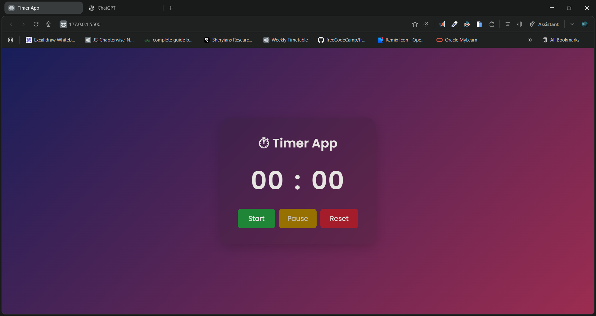

# ⏱️ Timer App

A simple, clean, and beautifully styled **Timer Application** built using **HTML, CSS, and JavaScript**.
It supports **Start**, **Pause**, and **Reset**, and even **auto-saves progress using LocalStorage**.

---

## 📸 Preview

> 

---

## 🎥 Demo Video

> 🎬 **Watch Demo:** [click to watch](./demo.mp4)

---

## 🔗 Live Demo

> 🌐 **Live App:** []()

---

## 🚀 Features

✔ Smooth timer with minute–second formatting
✔ Start, Pause, and Reset functionality
✔ Auto-saves timing using `localStorage`
✔ Modern glass-effect UI
✔ Responsive and mobile-friendly
✔ Lightweight and fast

---

## 🧩 Project Structure

```
📂 Timer-App
 ├── index.html
 ├── style.css
 └── script.js
```

---

## 🛠️ Technologies Used

* **HTML5**
* **CSS3 (Glassmorphism + Gradient UI)**
* **JavaScript (LocalStorage + Timer Logic)**

---

## 📜 How It Works

* Timer increments every 200ms using `setInterval()`
* Time is stored in `localStorage` to preserve state on reload
* UI updates dynamically with padded values (`00:00`)
* Start button disables while running; Pause disables when stopped

---

## 💡 Installation & Usage

1. Clone the repository:

   ```bash
   git clone 
   ```
2. Open the folder
3. Run the project using any Live Server or open `index.html` directly.

---

## 📌 Future Enhancements (optional)

* ⏰ Add custom countdown
* 🎵 Notification beep
* 🌓 Light/Dark mode
* ⏲ Lap timing feature

---

## 🧑‍💻 Author

Made with ❤️ by **Dileep kumawat**
- 📧 [dileepkumawat525@gmail.com](mailto:dileepkumawat525@gmail.com)
- 🔗 [LinkedIn](https://www.linkedin.com/in/dileep-kumawat/)

---

## ⭐ Show Support

If you like this project, consider **starring the repo** ⭐ on GitHub!

---